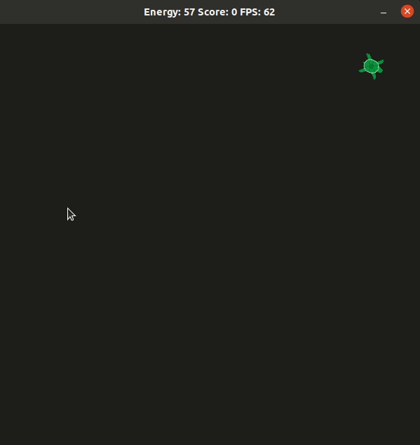

# CPPND: Capstone Snake Game Example

This is a submission repo for the Capstone project in the [Udacity C++ Nanodegree Program](https://www.udacity.com/course/c-plus-plus-nanodegree--nd213). The code for this repo is based on [this](https://github.com/udacity/CppND-Capstone-Snake-Game) provided snake game example.

In this project, I extended the Snake game, to create a pet simulation similarly to the tamagochi. The Game is a turtle simulation with the goal of feeding the turtle to keep its energy high. The Turtle is moving randomly over the field. Food can be placed by clicking into the game area, but watch out! clicking the turtle will reduce the energy and make the turtle faster.
In main.cpp three different difficulty levels can be given to the game.

## Structure
The verall structure follows the Snake Game example.
Main creates a Controller, Game and Render Object.
The Game object stores a unique pointer to a turtle object.
Controller and Renderer are handed to the run function, which starts the Gameloop.
A utilities namespace contains helper calsses to store and pass information.

## Addressed rubrics
* Loops, Functions, I/O
  * function organization visible in turtle.h/.cpp
  * file usage in renderer.cpp - 40
  * Click input controller.cpp - 18ff
* Object Oriented Programming
  * class structure see turtle.h/.cpp
  * member init lists turtle.cpp - 13-17
* Memory Management
  * Addressed in game.h with a unique pointer to the heap. The game class follows the rule of 5
* Concurrency
  * Not Addressed

## Dependencies for Running Locally
* cmake >= 3.7
  * All OSes: [click here for installation instructions](https://cmake.org/install/)
* make >= 4.1 (Linux, Mac), 3.81 (Windows)
  * Linux: make is installed by default on most Linux distros
  * Mac: [install Xcode command line tools to get make](https://developer.apple.com/xcode/features/)
  * Windows: [Click here for installation instructions](http://gnuwin32.sourceforge.net/packages/make.htm)
* SDL2 >= 2.0
  * All installation instructions can be found [here](https://wiki.libsdl.org/Installation)
  >Note that for Linux, an `apt` or `apt-get` installation is preferred to building from source.
* SDL2 image handling `Added from example`
  * sudo apt-get install libsdl2-image-2.0-0 libsdl2-image-dev
* gcc/g++ >= 5.4
  * Linux: gcc / g++ is installed by default on most Linux distros
  * Mac: same deal as make - [install Xcode command line tools](https://developer.apple.com/xcode/features/)
  * Windows: recommend using [MinGW](http://www.mingw.org/)

## Basic Build Instructions

1. Clone this repo.
2. Make a build directory in the top level directory: `mkdir build && cd build`
3. Compile: `cmake .. && make`
4. Run it: `./SnakeGame`.

## CC Attribution-ShareAlike 4.0 International

Shield: [![CC BY-SA 4.0][cc-by-sa-shield]][cc-by-sa]

This work is licensed under a
[Creative Commons Attribution-ShareAlike 4.0 International License][cc-by-sa].

[![CC BY-SA 4.0][cc-by-sa-image]][cc-by-sa]

[cc-by-sa]: http://creativecommons.org/licenses/by-sa/4.0/
[cc-by-sa-image]: https://licensebuttons.net/l/by-sa/4.0/88x31.png
[cc-by-sa-shield]: https://img.shields.io/badge/License-CC%20BY--SA%204.0-lightgrey.svg
